<div align="center">

# ZCode Canvas

**给官方版 ZCode 换一身皮肤。**

主题 · 壁纸 · 毛玻璃 · 启动画面<br>
不用编译，不用维护 fork，随时逐字节还原。

[](#平台支持)
[](https://www.npmjs.com/package/zcode-canvas)
[](#平台支持)
[](LICENSE)

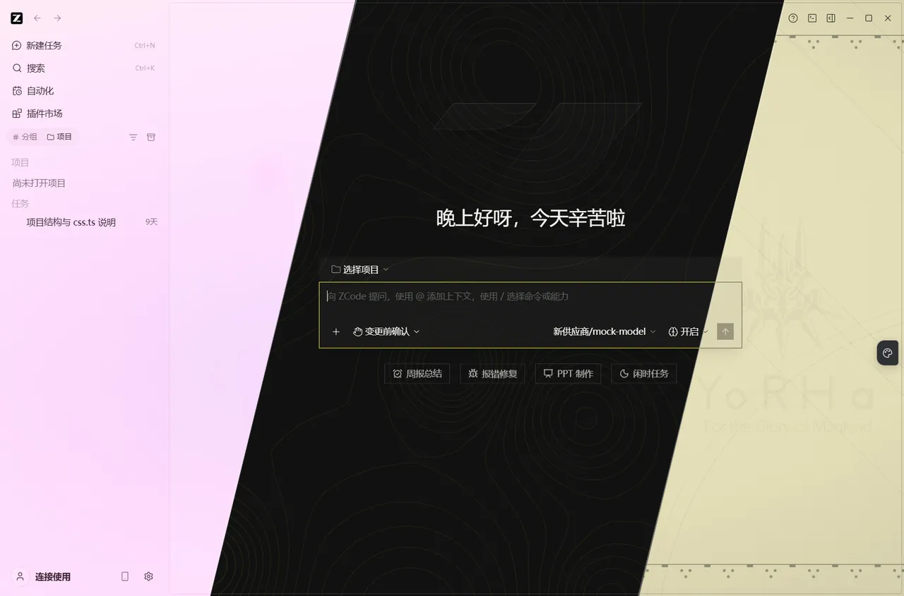

</div>

<br>

<table>
<tr>
<td width="33%" valign="top"><b>主题</b><br>一个文件夹就是一套主题：<code>theme.json</code> 加上用到的图片。</td>
<td width="33%" valign="top"><b>壁纸</b><br>常见图片格式都能用，GIF 会直接播放，模糊、缩放、色彩都能调。</td>
<td width="33%" valign="top"><b>毛玻璃</b><br>侧栏、主区域、卡片、输入框分别调透明度和模糊，也能透出系统原生材质。</td>
</tr>
<tr>
<td valign="top"><b>智能配色</b><br>从壁纸里取色，一键生成整套界面颜色，文字对比度自动把关。</td>
<td valign="top"><b>启动画面</b><br>背景、logo 和动画都能换，从第一帧开始就是你的主题。</td>
<td valign="top"><b>实时生效</b><br>改完约 1 秒刷新，不用重启 ZCode。</td>
</tr>
</table>

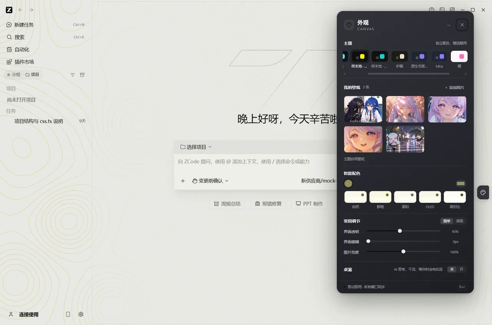

<p align="center"><sub>换主题、换壁纸、拖滑杆，界面当场刷新</sub></p>

### 放心用

- **不改原有字节**：补丁只往 `app.asar` 里追加文件，`restore` 能还原出和官方逐字节一致的文件。
- **出错也不影响 ZCode**：Canvas 任何部分出问题，最坏结果只是外观没生效，ZCode 照常启动。
- **不留常驻进程**：不开调试端口，不联网。
- **官方更新照常进行**：更新后只是回到官方原样，重新 `apply` 一次即可。

## 快速开始

需要 Node.js 20 或更高版本。

```sh
npm install -g zcode-canvas

zcode-canvas apply          # 给 ZCode 打补丁
zcode-canvas use endfield   # 切换主题，ZCode 实时刷新
```

不想全局安装，也可以一次性运行：`npx zcode-canvas apply`。

Windows 上 ZCode 装在受保护目录时要用管理员终端，Linux 用 `sudo`。在 Windows 上 ZCode 正在运行时 `apply`，要从托盘**彻底退出**一次 ZCode 才会换上补丁。其他细节见[平台支持](#平台支持)。

<details>
<summary><b>apply 之后看不到变化</b></summary>

<br>

先运行 `zcode-canvas status`：

- 显示“有待 ZCode 退出后替换的文件”：ZCode 还没彻底退出。请从托盘退出（关闭窗口只会缩到托盘），再重新打开。
- 补丁显示“未安装”：ZCode 可能刚更新过，重新 `apply` 一次。
- Canvas 显示“已关闭”：`config.json` 里的 `enabled` 被设成了 `false`。

</details>

<details>
<summary><b>从源码安装（想改代码或主题）</b></summary>

<br>

```sh
git clone https://github.com/Kevinzzz6/zcode-canvas.git
cd zcode-canvas
npm install && npm run build && npm link
```

</details>

<details>
<summary><b>想让 Agent 帮你装？</b>把这段话发给它</summary>

<br>

```text
帮我安装 ZCode Canvas（npm 包 zcode-canvas）。
先 npm install -g zcode-canvas，再 zcode-canvas apply，
装好后用 zcode-canvas status 确认补丁已安装。
需要管理员权限、sudo 或退出 ZCode 的步骤请交给我，不要自己结束 ZCode 进程。
最后切换到 endfield 主题。
```

</details>

## 外观中心

每个 ZCode 主窗口右侧都有一个 **外观** 小按钮。点开就是面板，背后的界面就是实时预览。也可以用快捷键 `Ctrl/Cmd+Alt+Shift+O`、托盘菜单、应用菜单或 `zcode-canvas open` 打开。

<table>
<tr>
<td width="50%" align="center" valign="top">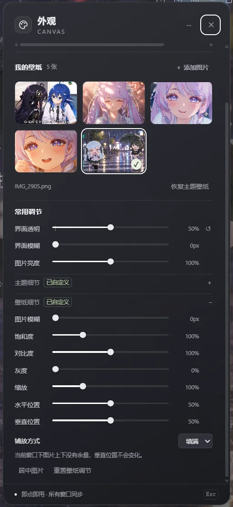</td>
<td width="50%" align="center" valign="top">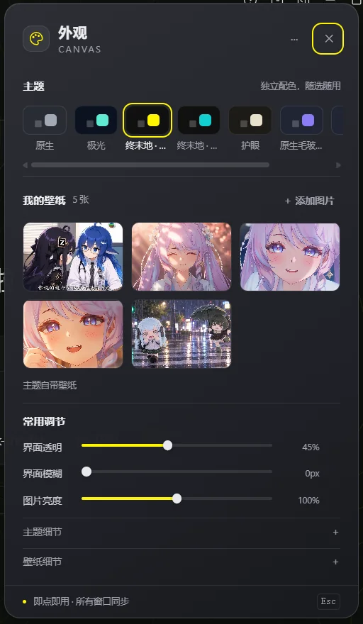</td>
</tr>
<tr>
<td align="center"><sub>展开“壁纸细节”，每一项都能精确调节</sub></td>
<td align="center"><sub>换成终末地主题后，面板也跟着换色</sub></td>
</tr>
</table>

**挑一个起点**

- **主题**：点色卡切换。你改过的强调色、圆角、材质和壁纸在切换时都会保留。
- **我的壁纸**：点一下就用上。“添加图片”会把图片复制进 Canvas 自己的壁纸库。

**调到满意**

- **智能配色**：从当前壁纸取出几个种子色（也可以自选），再选自然、鲜艳、柔和、OLED 或高对比，整套界面颜色一起生成。悬停预览，点击才应用；文字不够清楚时面板会提示。
- **分区玻璃**：侧栏、主区域、卡片、输入框分别调透明度和模糊，没单独调的区域跟随整体设置。按住或指向某个区域的滑杆时，ZCode 里对应的界面会描上一圈强调色边框，调的是哪一块一眼就能看出来。
- **滑杆**：拖动时实时预览，松手才保存，并同步到所有窗口。点数值可以直接输入，比如 `18px`、`1.5×`。
- **简单 / 高级**：简单模式只留常用调节，高级模式展开主题细节、分区玻璃和壁纸细节。

<p align="center">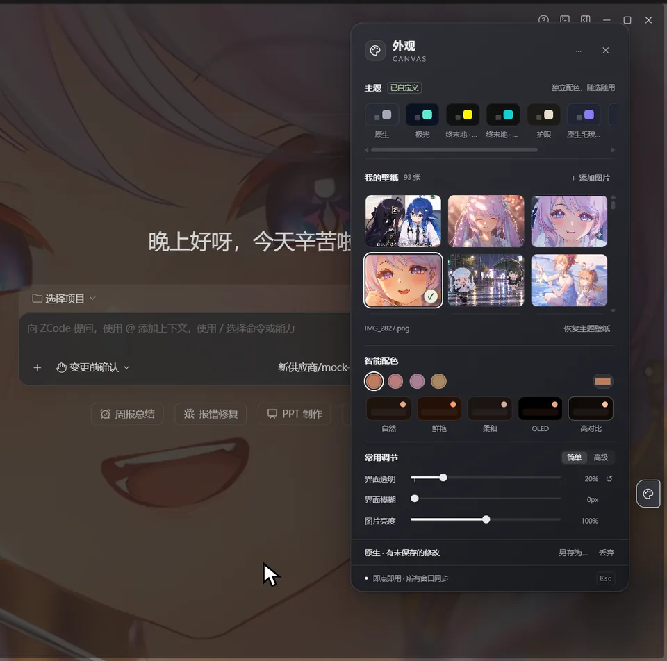</p>

<p align="center"><sub>点一个从壁纸里取出的颜色，悬停就能预览各种风格；换个颜色，整套界面跟着变</sub></p>

**留下来**

- **保存为主题**：有个人修改时，面板底部会出现保存条，可以存成新主题或写回当前主题，见[做一个自己的主题](#做一个自己的主题)。
- **单项重置**：偏离主题默认值的项，行尾会出现 ↺，点一下只恢复这一项。

<details>
<summary>更多细节</summary>

<br>

- 某项调节被其他设置挡住时，面板会就近说明原因。比如界面完全不透明时，壁纸就看不到。
- 入口默认在窗口右侧、状态栏上方。可以拖到左右两侧的边缘，右键可以隐藏或重置位置。
- 面板浮在界面上方，不会挤压编辑器。再次点击入口、按 Esc、点击面板外部或点关闭按钮都能收起，已应用的外观会保留。
- 切换简单 / 高级模式不会改动已保存的设置。
- “恢复主题默认”会删除个人的透明度与模糊（含分区）、材质、强调色、圆角和智能配色，保留壁纸相关的设置。
- 在 ZCode 里录制快捷键时，Canvas 的快捷键会自动让开。

</details>

## 主题

<table>
<tr>
<td width="50%">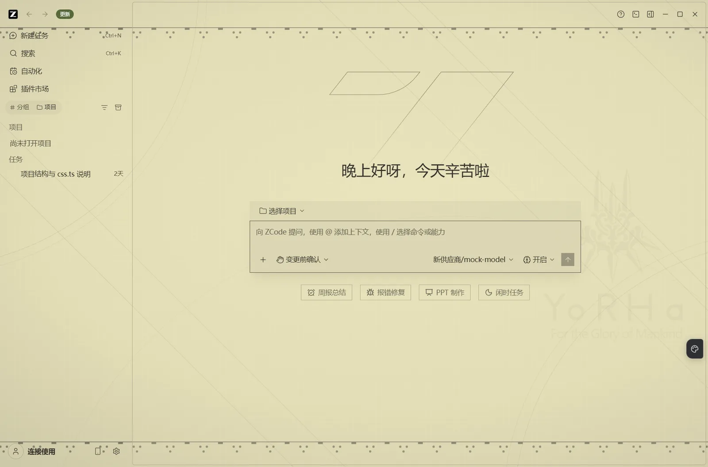</td>
<td width="50%">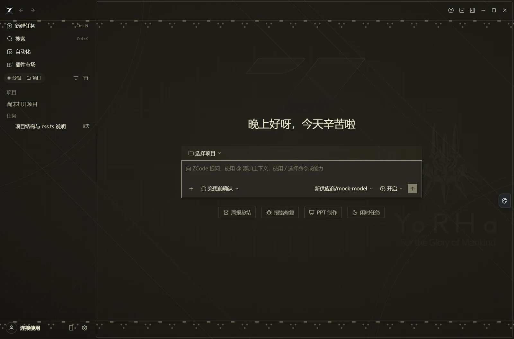</td>
</tr>
<tr>
<td colspan="2" align="center"><b>尼尔 · 寄叶</b> <code>yorha</code><br><sub>照 NieR:Automata 的系统设置界面做：中心亮、四周压暗的沙色纸面，细网格、构造线和点阵分隔带，全直角无阴影，右侧一枚几乎看不出的寄叶徽标。暗色是同一套构图的炭黑版。</sub></td>
</tr>
</table>

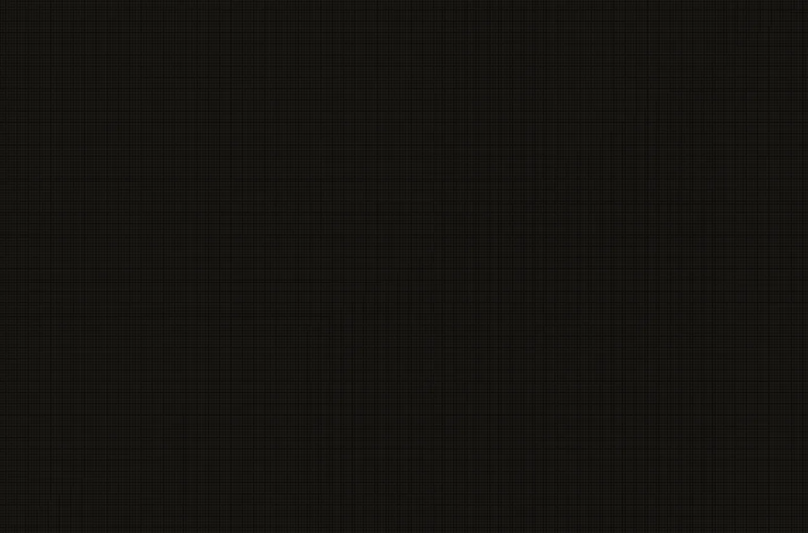

<p align="center"><sub>启动画面还原游戏的开机画面，淡入后才是沙色界面。非官方同人作品，寄叶徽标的权利归 SQUARE ENIX，不属于 MIT 许可，见 <a href="NOTICE.md">NOTICE.md</a>。</sub></p>

<table>
<tr>
<td width="50%">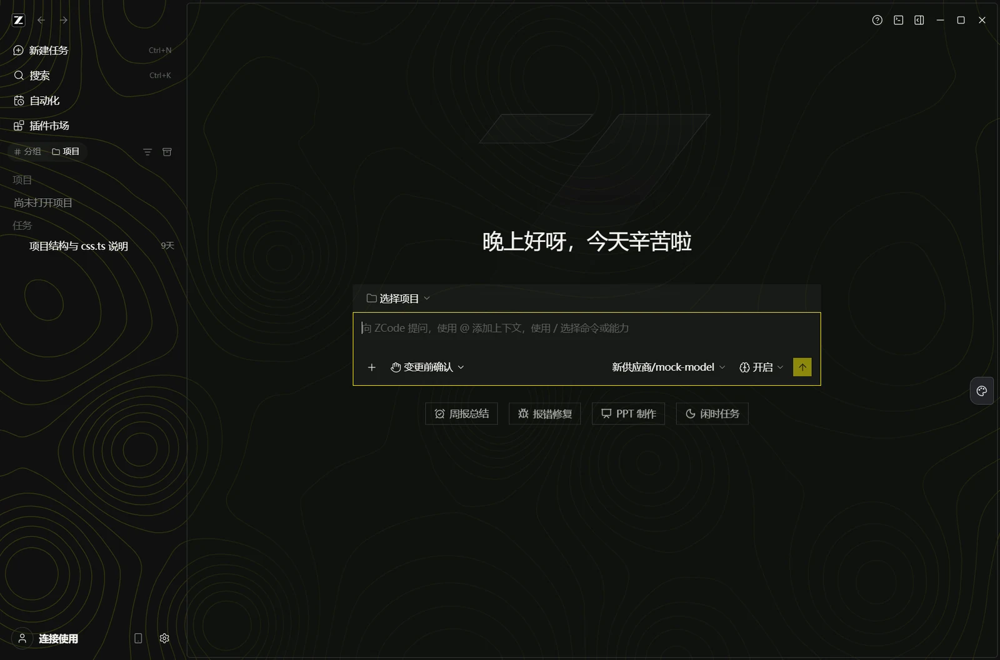</td>
<td width="50%">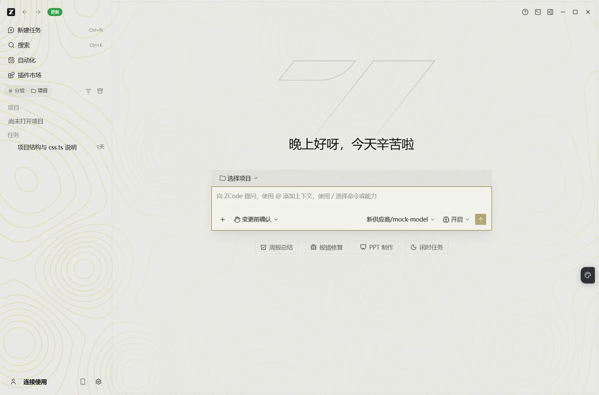</td>
</tr>
<tr>
<td colspan="2" align="center"><b>终末地 · 谷地黄</b> <code>endfield</code><br><sub>谷地黄强调色、等高线地形壁纸、全直角。暗色是墨黑底，亮色是奶油纸底。</sub></td>
</tr>
<tr>
<td>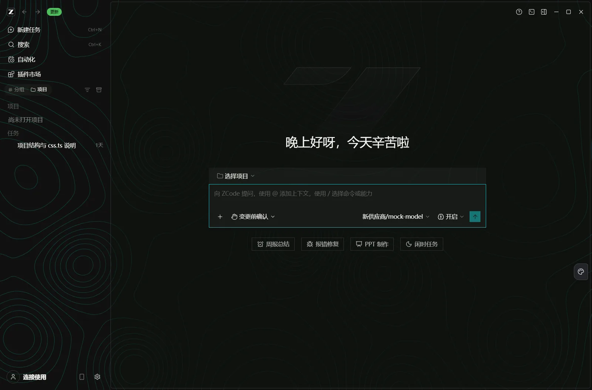</td>
<td>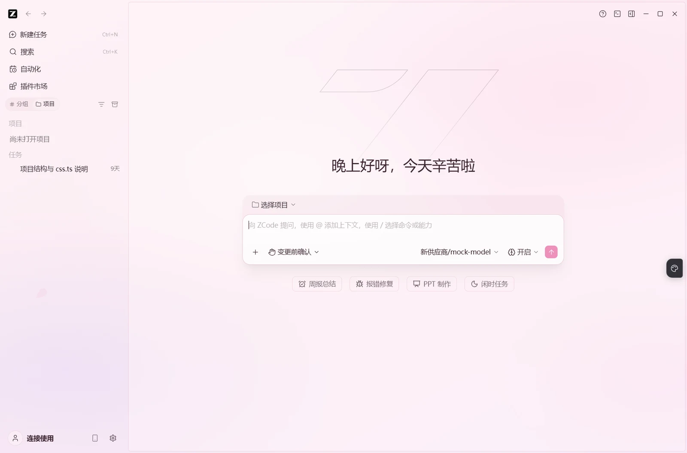</td>
</tr>
<tr>
<td align="center" valign="top"><b>终末地 · 武陵青</b> <code>endfield-wuling</code><br><sub>同一套设计的青色版本，亮色和暗色都有。</sub></td>
<td align="center" valign="top"><b>樱</b> <code>sakura</code><br><sub>柔和的樱粉渐变配粉色强调，适合亮色模式。</sub></td>
</tr>
</table>

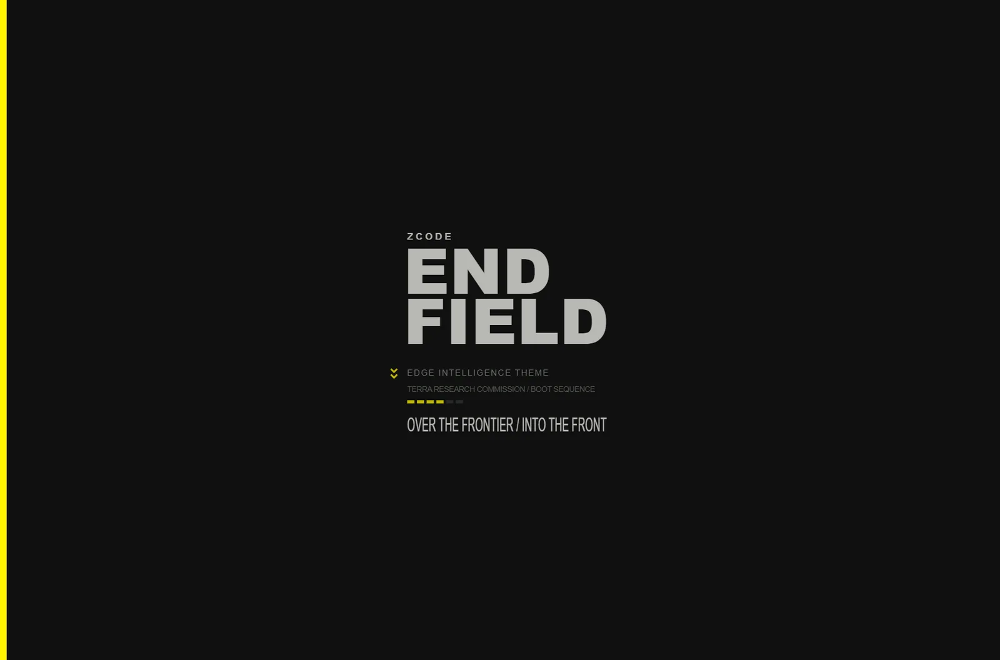

<p align="center"><sub>主题也能换掉启动画面。样式在首帧之前注入，不会先闪一下官方画面。</sub></p>

<details>
<summary>全部内置主题</summary>

<br>

| id | 名称 | 说明 |
|---|---|---|
| `endfield` | 终末地 · 谷地黄 | 改编自 [dsh-theme-endfield](https://github.com/ymh0000123/dsh-theme-endfield) |
| `endfield-wuling` | 终末地 · 武陵青 | 同上，青色版本 |
| `yorha` | 尼尔 · 寄叶 | 仿 NieR:Automata 系统设置界面，带寄叶徽标水印和游戏开机画面；非官方同人作品，徽标不属于 MIT，见 [NOTICE.md](NOTICE.md) |
| `sakura` | 樱 | 樱粉渐变，粉色强调 |
| `aurora` | 极光 | 深蓝夜空与极光渐变壁纸，青色强调，适合暗色 |
| `eye-care` | 护眼 | 偏暖低亮的底色配高对比正文，亮暗都有；配色改编自 [zcode-eye-care](https://github.com/VoodooB0Ys/zcode-eye-care) |
| `glass` | 原生毛玻璃 | 保留官方配色，只透出系统原生毛玻璃 |
| `mica` | Mica | 保留官方配色，改用 Windows 11 Mica 材质（其他平台等同 `glass`） |

</details>

## 做一个自己的主题

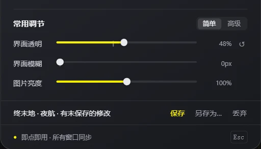

1. 在外观中心选一张壁纸（或者不用壁纸）。
2. 在“智能配色”里点一个种子色和一种风格，再按喜好调透明度、模糊和圆角。
3. 点底部保存条上的“另存为…”，起个名字，回车。

保存条上的“保存”会写回当前的用户主题，“丢弃”（点两次）回到主题原样。保存之后，修改就归主题所有，切走再切回来也还在。内置主题会随 Canvas 升级被覆盖，所以只能另存为。

<br clear="right">

新主题存在 `~/.zcode-canvas/themes/<id>/`：一个 `theme.json` 加上它用到的图片，图片都已复制进来，不依赖目录外的文件。放进这个目录的主题都会出现在外观中心里，用 `zcode-canvas use <id>` 启用时会按 schema 完整校验一遍。

想手写或精修 `theme.json`，照 [docs/theme-format.md](docs/theme-format.md) 改即可，[schema/theme.schema.json](schema/theme.schema.json) 能让编辑器补全和校验。主题格式目前是 format 1，以后只做向后兼容的新增。命令行里的 `zcode-canvas new <id>` 也能把当前外观存成主题，但不会切换过去。

<details>
<summary>个人修改和主题是怎么叠加的</summary>

<br>

- 个人修改在切换主题时会保留，所以切到另一个主题后，保存条仍可能显示“有未保存的修改”。它们会叠加在新主题上，想去掉就点“丢弃”。
- “保存”写回前，会把原来的文件留作同目录下的 `theme.json.bak`。想撤销这次保存，把它改名回 `theme.json`，ZCode 会立即刷新。保存时清空的个人修改不会一起回来。
- “另存为”不会改动原主题，不想要新主题时删掉它的文件夹即可。

</details>

## 壁纸

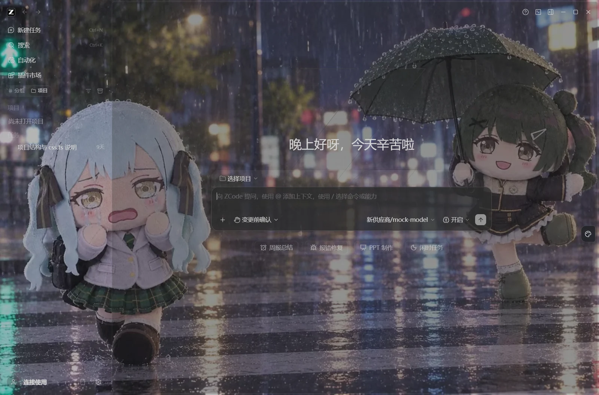

<p align="center"><sub>任何一张喜欢的图，都能铺满整个 ZCode</sub></p>

最简单的是在外观中心点“添加图片”，之后在“我的壁纸”里点一下就能换。支持 png、jpg、webp、avif、svg 和 GIF。命令行也可以：

```sh
zcode-canvas set wallpaper.image ~/pic.jpg          # 换壁纸
zcode-canvas set glass.opacity 0.5                  # 界面半透明，让壁纸透出来
zcode-canvas set wallpaper.dark.image ~/night.jpg   # 暗色模式单独用一张
```

<table>
<tr>
<td width="50%">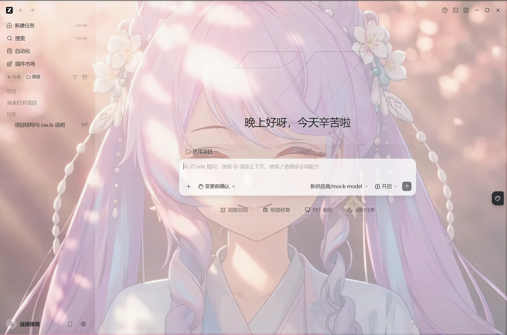</td>
<td width="50%">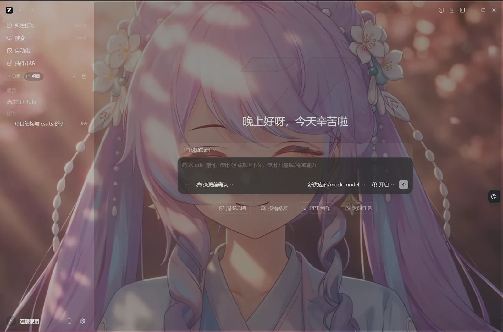</td>
</tr>
<tr>
<td colspan="2" align="center"><sub>同一张壁纸，亮色和暗色下界面会自动换成对应的底色</sub></td>
</tr>
</table>

设置了壁纸却看不到，通常是界面完全不透明把它盖住了：把 `glass.opacity` 调低，或者在外观中心调低“界面透明”。在 Windows 上，壁纸会盖住系统原生的毛玻璃材质，两者只能看到一个。

**导入 Wallpaper Engine 壁纸**：`zcode-canvas wallpaper import <项目目录>` 会导入 `type: image` 项目的原图。`scene`、`video`、`web` 类型只有加上 `--preview` 才会导入预览图。整个过程只读取你指定的目录，不联网，不执行其中的任何内容，也不修改 Wallpaper Engine 的文件。

```sh
zcode-canvas wallpaper import "D:\SteamLibrary\steamapps\workshop\content\431960\<项目 id>"
```

导入的图片存在 `~/.zcode-canvas/imports/wallpaper/`，也会出现在外观中心的“我的壁纸”里。

## 命令行

```sh
zcode-canvas status                               # 查看安装状态和当前主题
zcode-canvas themes                               # 列出主题
zcode-canvas use <id | none>                      # 切换主题
zcode-canvas set accent "#7c5cff"                 # 强调色
zcode-canvas set radius 0                         # 全直角
zcode-canvas set palette.seed "#5eead4"           # 智能配色：从一个颜色生成整套界面颜色
zcode-canvas set palette.variant oled             # natural | vivid | soft | oled | contrast
zcode-canvas set glass.regions.input.opacity 0.9  # 只让输入框更不透明，其余跟随 glass.opacity
zcode-canvas unset wallpaper                      # 删除一项或一组设置，回到主题默认值
zcode-canvas new <id>                             # 把当前外观存成新主题
zcode-canvas open                                 # 打开外观中心；ZCode 没运行时打开配置目录
zcode-canvas help                                 # 所有命令和可设置的键
```

所有设置都存在 `~/.zcode-canvas/config.json`，直接编辑也可以，保存后立即生效。个人设置会叠加在主题之上：比如 `accent` 会覆盖主题的强调色，在 `colors` 里显式写出的 token 优先级最高。

## 更新与卸载

官方更新会整体替换 `app.asar`，补丁也就随之消失，ZCode 回到官方原样，不会损坏。重新运行一次 `zcode-canvas apply` 就能恢复，只需要几秒。主题和配置都在 `~/.zcode-canvas/`，不受更新影响。

升级 Canvas 本身也要再 `apply` 一次。运行时是在 `apply` 时装进 `~/.zcode-canvas/` 的，只更新 npm 包不会换掉它：

```sh
npm install -g zcode-canvas@latest
zcode-canvas apply             # 换上新的运行时，重启 ZCode 后生效
```

卸载：

```sh
zcode-canvas restore           # 还原 app.asar，和官方文件逐字节一致
zcode-canvas restore --purge   # 同时删除 ~/.zcode-canvas（包括你的主题和壁纸库）
```

想临时关掉 Canvas 有两种方法：在 `config.json` 里设置 `"enabled": false`；或者用环境变量 `ZCODE_CANVAS_DISABLE=1` 启动 ZCode，这时补丁什么都不会加载。

## 平台支持

已在 ZCode 3.14.4（Electron 41）上验证。

| 平台 | 安装格式 | 状态 |
|---|---|---|
| Windows 10 / 11 | NSIS 安装版 | 已验证 |
| Fedora / RHEL 等 rpm 系 | `.rpm`（装在 `/opt/ZCode`） | 已验证 |
| Debian / Ubuntu、Arch | `.deb` / `.pacman` | 目录结构相同，未逐一验证 |
| macOS | `.dmg`（拖入 /Applications） | `apply` 后自动重签名 |
| Linux AppImage | — | 不支持 |

ZCode 装在非默认位置时，可以用 `--zcode <目录>` 指定。

<details>
<summary><b>Windows</b></summary>

<br>

- ZCode 装在 Program Files 这类受保护目录时，需要用管理员身份运行终端。
- ZCode 正在运行时 `app.asar` 会被占用。Canvas 会先准备好补丁，再启动一个一次性小进程，等 ZCode 退出后替换，然后立即结束。所以直接在 ZCode 自带的终端里运行也没问题，从托盘彻底退出再打开就能看到效果。

</details>

<details>
<summary><b>macOS</b></summary>

<br>

- ZCode.app 不可写时加 `sudo`。建议先启动过一次 ZCode 再 `apply`。macOS Tahoe 实测带着 quarantine 标记也能正常打开，Canvas 重签后也会顺手清掉它，但旧系统版本可能仍要求先放行一次。
- **签名、登录和钥匙串**：修改 `.app` 会破坏官方代码签名，Canvas 会自动做 ad-hoc 重签名，随后自检签名。真机实测（macOS Tahoe 25.4）：重签后启动正常，登录态、钥匙串和历史会话都不受影响，因为 ZCode 的凭据存放在本地文件里，不依赖钥匙串。`restore` 会把 `app.asar` 逐字节还原，但签名仍然是 ad-hoc 的；想完全回到官方签名，重新安装一次 ZCode 即可。
- **毛玻璃材质**：macOS 的 ZCode 窗口官方就带 under-window vibrancy。`glass.material` 保持默认（`acrylic`）时沿用官方原生材质观感，不会透出壁纸；设为 `none` 会关闭 vibrancy，界面透明区域改为透出窗口后方的内容。想透出壁纸，调低 `glass.opacity` 即可。

</details>

<details>
<summary><b>Linux</b></summary>

<br>

- ZCode 装在 `/opt/ZCode`，属于 root，所以 `apply` 需要 sudo。Canvas 会识别 `SUDO_USER`，把运行时和配置装到**你的**用户目录而不是 `/root`，文件所有权也会交还给你。
- 如果 sudo 找不到命令，可以用 `sudo env "PATH=$PATH" zcode-canvas apply` 或 `sudo "$(which zcode-canvas)" apply`。文件可以随时替换，重启 ZCode 后生效。
- 窗口透明依赖桌面合成器。合成器不支持时，毛玻璃会退化成纯色；壁纸不受影响，因为它是画在页面内部的。
- 不支持 AppImage：它的 `app.asar` 封在只读文件系统里，没法打补丁。请改装 rpm、deb 或 pacman 包，比如 Fedora 上用 `sudo dnf install ./ZCode-*.x86_64.rpm`。

</details>

## 工作原理

1. **补丁只追加，不修改**。`app.asar` 里只多出三样东西：一个改了 `main` 字段的 `package.json`、一个约 20 行的引导脚本，以及还原所需的记录。第一次打补丁前，Canvas 会先验证官方 `app.asar` 能被逐字节还原，验证不通过就拒绝打补丁。
2. **样式在首帧之前注入**。运行时在 ZCode 主进程里给页面注册预加载脚本，用 `webFrame.insertCSS` 注入样式，所以连启动画面都能改。样式不写进 DOM，React 碰不到它。
3. **只依赖稳定的结构**：ZCode 的 `--color-*` 设计 token、主题 class、窗口外框和启动画面节点。ZCode 本来就用了半透明窗口，只是被不透明的外框盖住了，所以毛玻璃只需要把这些 token 调成半透明。
4. **为什么改 `app.asar`，而不是远程注入**：CDP 类方案要求 ZCode 一直由第三方启动器带着调试端口启动，从 Dock 或 Spotlight 直接打开就没有主题，而且拿不到外观中心面板、菜单栏入口和启动画面。修改 `app.asar` 换来的 ad-hoc 重签名经真机验证不影响登录、钥匙串和启动。等上游提供官方扩展点后，这条路会被取代。

调研过程见 [docs/analysis.md](docs/analysis.md)，依赖了哪些 ZCode 内部实现、各部分的稳定性承诺见 [docs/design.md](docs/design.md)。

## 开发

改代码或提 issue 前请先读 [docs/design.md](docs/design.md)，它规定了安全底线、各部分的稳定程度，以及哪些问题要修、哪些不修。

```sh
npm run typecheck
npm test
npm run build
```

<details>
<summary>沙盒与冒烟测试</summary>

<br>

- `scripts/sandbox.mjs` 会启动一份官方 ZCode 的副本，身份和数据目录完全隔离；配合 `scripts/cdp.mjs` 可以截图验证，不会碰到你正在用的 ZCode。这两个脚本目前只支持 Windows，仅供开发使用，Canvas 本身不使用 CDP。
- `node scripts/runtime-smoke.mjs` 会在隔离的 Electron 实例里验证多窗口同步、辅助窗口排除和 IPC 越界拒绝，不打开调试端口。
- `node scripts/overlay-smoke.mjs` 会在开发沙箱里验证真实外观中心的点选、预览与提交、失败恢复、入口拖动与隐藏等行为，并保存截图。它只接受明确指定的沙箱目录，临时改动的配置会在结束时还原。
- `endfield` 两套主题的壁纸和启动字标由 `npm run build:endfield` 生成，生成结果已经提交。只有想换地形（`--seed <n>`）或改排版时才需要重新运行。
- `yorha` 主题的壁纸和启动画面由 `npm run build:yorha` 生成，生成结果已经提交。加 `-- --no-emblem` 会生成不带徽标的版本。

</details>

## 致谢

以下社区项目在 ZCode 开源之前就做出了外观增强，是本项目的重要参考：
[zcode-beautify](https://github.com/Logocceai/zcode-beautify)、
[zcode-dream-skin](https://github.com/Alan-dong-dong/zcode-dream-skin)、
[zcode-eye-care](https://github.com/VoodooB0Ys/zcode-eye-care)、
[zcode-skin-center](https://github.com/Theater-ahyeon/zcode-skin-center)、
[zcode-mod-kit](https://github.com/Adam1290-0/zcode-mod-kit)、
[zcode-miku-theme](https://github.com/foambai/zcode-miku-theme)、
[dream-work-theme](https://github.com/xxxhh336/dream-work-theme)。

`endfield` 主题改编自 DSH 主题 [dsh-theme-endfield](https://github.com/ymh0000123/dsh-theme-endfield)（MIT），详见 [NOTICE.md](NOTICE.md)。

`yorha` 主题是 NieR:Automata 的非官方同人作品，与 SQUARE ENIX、PlatinumGames 无关。寄叶徽标的权利归 SQUARE ENIX 所有，不适用本项目的 MIT 许可，详见 [NOTICE.md](NOTICE.md)。

本项目与 ZCode 官方无关。修改 `app.asar` 的风险由使用者自行承担。

## 许可

[MIT](LICENSE)
